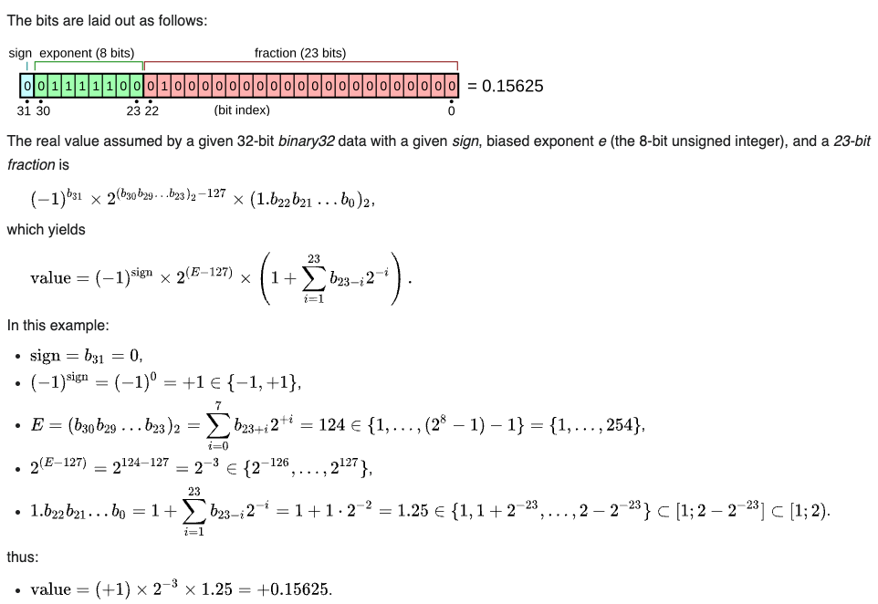

# Beej_NP
[Beej's Guide to Network Programming Using Internet Sockets](https://beej.us/guide/bgnet/)

## chap7-1
1. 有人说recv只是与socket的接收缓冲区打交道，而不是recv本身从对方接收数据。同时send只是与发送缓冲区打交道，而不是send本身将数据发给对方。如何理解？

    这句话强调recv和send这两个操作实际上并不是直接与对端的程序打交道，而是与OS的网络缓冲区打交道。
    1. recv和接收缓冲区
    
        当你调用recv时，recv从操作系统内核中的接收缓冲区(socket's receive buffer)读取数据。这个缓冲区是OS为该套接字分配的一个临时存储区域。

        流程如下：
        - 当数据从网络上到达你的主机时，OS会将这些数据放到套接字的接收缓冲区中。
        - recv调用会读取这些已经在缓冲区的数据，而不是直接去网络上“取”数据。
        - **如果接收缓冲区里有数据，recv会立即返回这些数据**。
        - **如果接收缓冲区为空，recv在阻塞模式下会等待数据到达**（或在**非阻塞模式下会立即返回一个错误，如EAGAIN或EWOULDBLOCK**）。

    2. send和发送缓冲区

        当你调用send时，send并不会直接把数据发给对方，而是将数据放入发送缓冲区(socket's send buffer)。

        流程如下：
        - 当你调用send时，数据会被copy到发送缓冲区。
        - OS随后在后台将发送缓冲区中的数据通过网络发送出去，这个过程是**异步**的。
        - **如果发送缓冲区有足够空间，send会立即成功，将数据放入缓冲区后返回。**
        - **如果发送缓冲区已满，send在阻塞模式下会等待**缓冲区有空余（或在非阻塞模式下会立即返回错误，如EAGAIN或EWOULDBLOCK）。

    3. 关键点
        - recv和send与对端程序没有直接交互，它们只是和OS的缓冲区交互。
        - OS的缓冲区在网络数据的传输过程中充当一个缓冲角色，使得发送和接收过程能够异步进行，提升了效率。
        - **recv和send的调用结果依赖于缓冲区的状态（是否有数据，是否有空余）**，而非直接依赖于对端是否发送或接收。
2. `int fcntl(int fd, int op, ... /* arg */ );`
        
    如果将server端的通信套接字设置为非阻塞，那么影响的是client的recv和send还是server的recv和send？
        
    影响的是服务器端的recv和send操作，而不是客户端的recv和send操作
    1. 服务器端的recv：当服务器调用recv去接收数据时，如果没有数据可用，**recv会立即返回-1**，并将errno设置为EAGAIN或EWOULDBLOCK，表示当前没有数据可读取。服务器可以继续执行其他操作而无需等待数据到达
    2. 服务器端的send：当服务器调用send发送数据时，如果发送缓冲区已满，send会立即返回-1，并将errno设置为EAGAIN或EWOULDBLOCK，表示无法立即发送。服务器可以选择稍后重试发送数据。
    3. 补充：服务器端的accept：当服务器调用accept等待新用户连接时，如果当前accept设置为阻塞(默认)，那么会阻塞直到新用户连接才返回。如果设置为非阻塞，那么accept会立即返回-1，并将errno设置为EAGAIN或EWOULDBLOCK，表示当前无新用户连接。
    4. RETURN VALUE
        1. `ssize_t recv(int sockfd, void *buf, size_t len, int flags);`:   
        These calls return the number of bytes received, or -1 if an error occurred.  In the event of an error, errno is set to indicate the error. **When a stream socket peer has performed an orderly shutdown, the return value will be 0 (the traditional "end-of-file" return).**
        2. `int accept(int sockfd, struct sockaddr *addr, socklen_t *addrlen);`:   
        On success, these system calls return a nonnegative integer that is a file descriptor for the  accepted  socket. On error, -1 is returned, errno is set appropriately, and addrlen is left unchanged.
        3. `ssize_t send(int sockfd, const void *buf, size_t len, int flags);`:   
        On success, these calls return the number of bytes sent.  On error, -1 is returned, and errno is set appropriately.
    5. ERRORS(部分截取)
        > EAGAIN or EWOULDBLOCK  
        > The socket is marked nonblocking and **the receive operation would block, or a receive timeout had been set and the timeout expired before data was received.**/(**the requested operation would block.**)/(**no connections are present to be accepted**) POSIX.1 allows either error to be returned for this case, and does not require these constants to have the same value, so a portable application should check for both possibilities.

3. 理解阻塞和非阻塞模式对recv的影响（send同理）：
    1. 非阻塞模式的行为：当recv调用的接收缓冲区为空时，recv立即返回-1，并将errno设置为EAGAIN或EWOULDBLOCK，表示没有数据可供读取。**其避免了进程被挂起，但会导致程序不断尝试recv，即所谓的“忙等待”现象，这会耗费CPU资源。**因此，在实际使用中，非阻塞模式通常结合select或poll等系统调用，以高效地等待数据而避免忙等待。
        ```shell
        client: connecting to 139.224.234.82
        recv: Resource temporarily unavailable
        client: received 'Hello, World!'
        recv: Resource temporarily unavailable
        recv: Resource temporarily unavailable
        recv: Resource temporarily unavailable
        recv: Resource temporarily unavailable
        client: received 'Hello, World!'
        ```
    2. 阻塞模式的行为：当接收缓冲区为空，recv会阻塞进程，直到数据到达。**这会将该进程挂起，使CPU可调度其他任务。**此时，OS会将进程置于等待队列中，等待数据到达并解除阻塞。这种方式不会导致忙等待，但会影响响应时间，因为recv调用会一直阻塞直到有数据可读。
        ```shell
        client: connecting to 139.224.234.82
        client: received 'Hello, World!'
        client: received 'Hello, World!'
        client: received 'Hello, World!'
        ```
    3. 适用场景：非阻塞模式适用于需要实时响应的情况，例如实施数据采集或多客户端的服务器。在这种情况下，结合select或poll等多路复用机制，服务器可以高效地管理多个客户端的连接。
## chap7-2
1. [How to use epoll? A complete example in C](https://web.archive.org/web/20120504033548/https://banu.com/blog/2/how-to-use-epoll-a-complete-example-in-c/)
2. epoll结构体中data字段有什么用？
    ```cpp
    typedef union epoll_data
    {
    void        *ptr;
    int          fd;
    __uint32_t   u32;
    __uint64_t   u64;
    } epoll_data_t;

    struct epoll_event
    {
    __uint32_t   events; /* Epoll events */
    epoll_data_t data;   /* User data variable */
    };
    ```
    1. data字段是用户自定义数据的存储区域，允许epoll在事件发生时携带一些上下文信息。
    2. data.ptr可以存储一个指针，常用于指向一个与事件相关的结构体，便于在回调中访问该事件的上下文。
3. 如果select/poll/epoll监听的socket都是非阻塞的，但是它们在等待事件发生时设置了等待时间，那么此时如果没有事件发生的话，还需要等吗？ 如果等待时间为-1呢？ 
    1. 对于非阻塞 socket，select、poll、epoll 的意义在于：这些 socket 在调用 I/O 操作（如 accept/read/write）时不会阻塞应用程序。
    2. 即使 select 等函数在等待事件时设置了超时时间，应用程序仍可以决定超时时间的长短，并且在检测到事件发生后可以快速进行非阻塞 I/O 操作。
## chap7-3
1. select的BUGS(`man select`)
    >Under Linux, select() may **report a socket file descriptor as "ready for reading", while  nevertheless  a subsequent  read  blocks**. This could for example happen when data has arrived but upon examination has wrong checksum and is discarded. There may be other circumstances in which a file descriptor is  **spuriously reported as ready**. Thus it may be safer to use **O_NONBLOCK** on sockets that should not block.
2. 尽管select和poll API强调可同时监听多种类型的事件，但是往往在使用时只设置"ready for reading"事件，这是为什么？
    1. 常见场景主要是等待客户端的请求
        许多网络程序（Webserver）最常见的任务是等待客户端的请求或数据（可读事件）。服务端往往先等待客户端发送的数据，接收后再决定如何处理并响应。可读事件常常是触发业务逻辑的关键。
    2. 可写事件的触发频率较高
        在默认情况下，一个socket在没有阻塞的情况下，通常会一直处于可写状态。这意味着，如果我们监听可写事件，则poll或select可能会频繁地返回该事件，即使没有需要写入的数据。这种频繁的返回会浪费资源，增加不必要的CPU占用。
    3. 写操作通常在需要时直接进行
        由上述可知，大多数应用在有数据需要写入时会/可以直接执行写操作。
3. 返回值rv和errno的关系
    1. 大多数系统调用在失败时会返回-1或NULL，并设置errno
    2. errno提供了具体的错误原因，但在每次成功的函数调用后不会自动清零（手动设0以便于检测新的错误）。
    3. errno的错误信息可以通过perror或strerror(errno)来获取用户友好的描述。
4. send函数在阻塞socket下会保证发送完全部数据后返回，而在非阻塞socket下需要手动保证：
    > **[阻塞 socket 是否能确保所有数据都发送完？]**
    ```cpp
    int sendall(int s, char *buf, int *len) {
        int flags;
        if((flags = fcntl(newfd, F_SETFL, 0)) < 0) { // 获取当前flags
            perror("fcntl");
            return 2;
        }
        flags |= O_NONBLOCK;    // 在原flags上添加非阻塞标志
        if((rv = fcntl(newfd, F_SETFL, flags)) < 0) { // 设置新的flags
            perror("fcntl");
            return 2;
        }

        int total = 0;              // how many bytes we've sent 
        int bytesleft = *len;       // how many we have left to send 
        int n;

        while(total < *len) {
            n = send(s, buf+total, bytesleft, 0);
            if(n == -1) {break;}

            total += n;
            bytesleft -= n;
        }
        *len = total;               // return number actually sent here 
        return n == -1 ? -1 : 0;    // return -1 on failure, 0 on success
    }
    ```

## chap7-5
1. 浮点数的二进制表示: [IEEE754](https://en.wikipedia.org/wiki/Single-precision_floating-point_format)
    > **[ieee754.c程序是如何实现的呢？]**
    


## 个人笔记
1. server端的监听socket为什么需要bind()? 为什么accept返回的通信socket不需要？主机有多个IP出于什么考虑？
    1. 服务器端需要bind(): bind()的作用是将一个特定的IP地址和端口号与server端的套接字关联起来，以便监听并接受来自客户端的连接请求。
    2. 支持多网卡或多个IP地址的情况: bind()允许服务器绑定到特定的IP地址，或者使用INADDR_ANY(0.0.0.0)来绑定所有可用的网络接口。
    3. accept()返回的通信套接字不需要bind是因为它继承了监听套接字的绑定信息，并且accept的本质是从已有连接中提取一个用于通信的套接字。
2. 主机有多个IP出于什么考虑？
    1. 多网卡配置: 一台主机安装了多个网络接口卡(NIC)，每个网络接口可以绑定不同的IP地址。例如一个网卡绑定到内网，一个网卡绑定到外网，分别绑定内网和公网IP。
    2. 支持不同的网络协议: 同时支持IPv4和IPv6。

